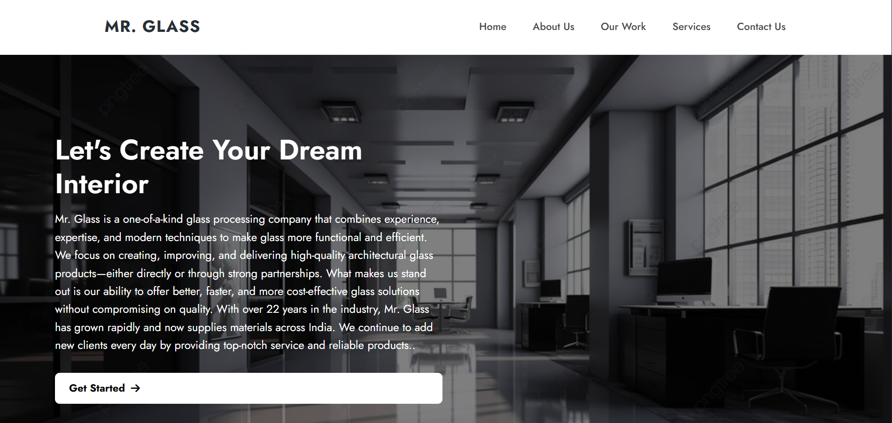

# Mr. Glass – Static Website (Dockerized)

A clean and responsive static website built using HTML, CSS, and JavaScript, containerized with Docker and served using Nginx.

# Project Overview
Type: Static Website
Frontend: HTML, CSS, JavaScript
Web Server: Nginx
Containerization: Docker
Deployment Ready: EC2 / VPS / On-Prem Linux Server

## Project Structure
Mr.glass/
index.html
about.html
work.html
thankyou.html
style.css
script.js
images/
pdfs/
Dockerfile

## Getting Started

Prerequisites
Ubuntu / Linux system
Internet connection
Sudo access

### Docker Installation
  ```bash
sudo apt update
sudo apt install docker.io -y
sudo systemctl start docker
sudo systemctl enable docker
docker --version
 ```

### Docker User Permission
 ```bash
sudo usermod -aG docker $USER
newgrp docker
 ```

### Build Docker Image
 ``` bash
cd Mr.glass
docker build -t mr-glass-website .
 ```
### Run the Container
 ```bash
docker run -d -p 80:80 --name mr-glass mr-glass-website
 ```
### Access the Website
 ``` bash
http://localhost
or
http://<server-ip>
 ```
### Stop and Remove Container
 ``` bash
docker stop mr-glass
docker rm mr-glass
docker rmi mr-glass-website
 ```
### Architecture Decisions
Docker for consistency
Nginx for performance
Static design for simplicity

## Home Page


Author
### Bakhtawar Khan
